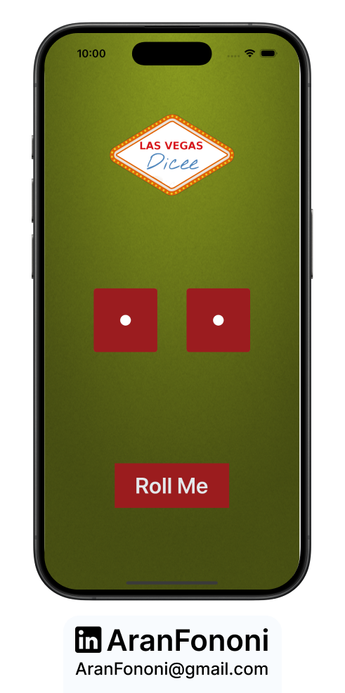
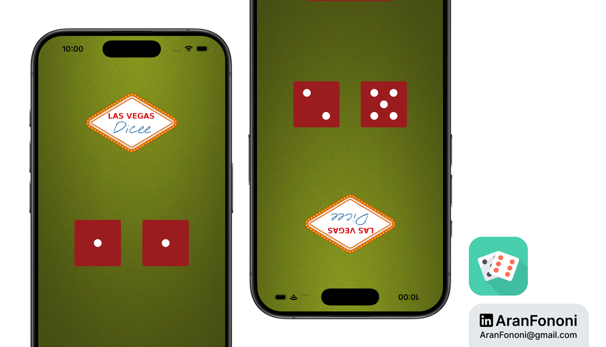

# Dicee

### Project for Section 4: **Basic UIKit Auto Layout**  
This project was completed as part of Section 4 in the **Complete iOS Development Bootcamp** by Angela Yu. I later refined it in Section 6 by adding advanced Auto Layout techniques.

## Project Overview
**Dicee** is a simple and fun dice roller app. The app allows users to roll two dice and see the results instantly. I focused on making the interface clean and easy to use while implementing basic Auto Layout principles.

## What I Learned
In this project, I learned:
- **Basic Auto Layout**: Set up constraints to ensure the app displays well on different devices.
- **User Interaction**: Created a simple button to trigger the dice roll, enhancing the app's interactivity.
- **Dynamic UI Updates**: Used Swift to change the dice images based on random rolls.

## Key Skills
- Basic Auto Layout
- User Interaction with Buttons
- Working with Images in Swift

---

### Project Preview

---

### Footer

---

## Contact
For more information, feel free to reach out:  
- **Email**: [aranfononi@gmail.com](mailto:aranfononi@gmail.com)  
- **LinkedIn**: [Aran Fononi](https://www.linkedin.com/in/aran-fononi-18182b265)
